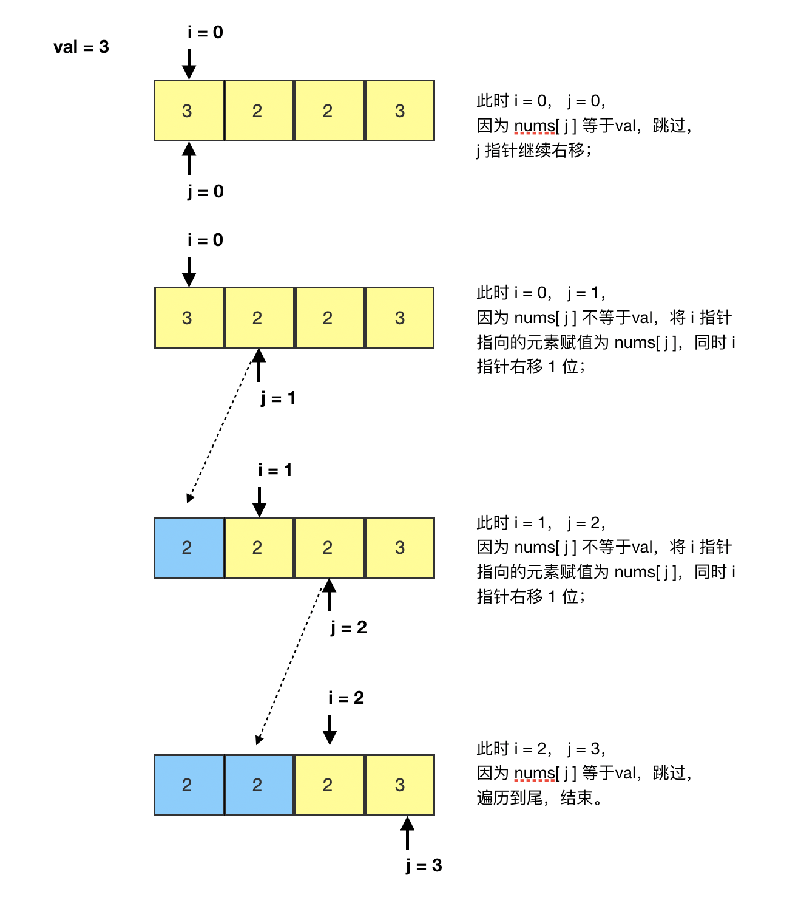

- 給定一個陣列 nums 和一個數值 val，將陣列中所有等於 val 的元素刪除，並返回剩餘的元素個數。



```go
func removeElement(nums []int, val int) int {
	if len(nums) == 0 {
		return 0
	}
	j := 0
	for i := 0; i < len(nums); i++ {
		// nums[i] == val 就跳過, 不處理
		// nums[i] != val nums[i], nums[j] 交換判斷
		// 不等於 val 的值都靠左邊, 就可以刪除右邊等於 val 的值

		if nums[i] != val {

			// 當 i != j 才交換, 如果 i == j 表示同一個 index, 跳過
			// j 表示要移動到的位置, 就是將非 val 的值, 透過交換方式靠左

			if i != j {
				nums[i], nums[j] = nums[j], nums[i]
			}

			// nums[i] != val 就 j++
			// 回傳不等於 val 的個數
			j++
		}
	}
	return j
}

```
